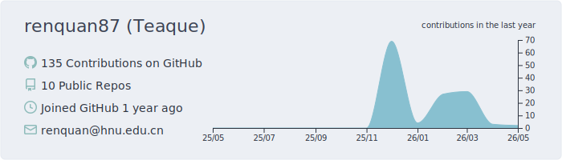
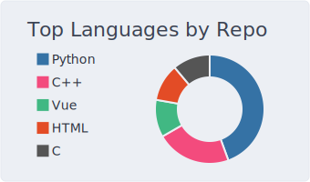
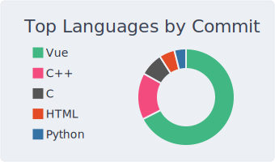
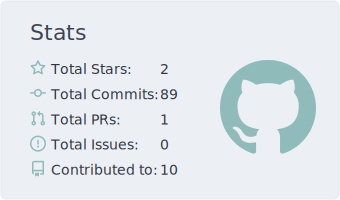
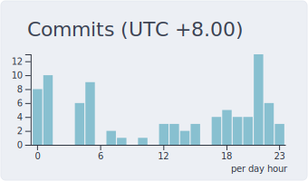

<h1 align="center">Hi, I'm Teaque </h1>

  <em>Sophomore in Software Engineering @ Hunan University</em>

  Passionate about <strong>Robotics</strong>, <strong>Computer Vision</strong>, and <strong>Multi-Modal Perception</strong>. 
  Always learning, always growing, and always open to meeting new friends. 

  
  

---

### 📂 Current Projects

[**HNURM-radar-2026**](https://github.com/renquan87/hnurm_radar) — Multi-sensor perception system for the RoboMaster 2026 radar station. Fuses camera-based YOLO detection with Livox LiDAR point cloud processing to achieve real-time  localization.

---

### 📊 GitHub Stats

<table>
  <tr>
    <td width="50%">
      <picture>
        <source media="(prefers-color-scheme: dark)" srcset="https://github-readme-stats-sigma-five.vercel.app/api?username=renquan87&show_icons=true&theme=tokyonight&hide_border=true" />
        <source media="(prefers-color-scheme: light)" srcset="https://github-readme-stats-sigma-five.vercel.app/api?username=renquan87&show_icons=true&theme=default&hide_border=true" />
        
      </picture>
    </td>
    <td width="50%">
      <picture>
        <source media="(prefers-color-scheme: dark)" srcset="https://github-readme-stats-sigma-five.vercel.app/api/top-langs/?username=renquan87&layout=compact&theme=tokyonight&hide_border=true" />
        <source media="(prefers-color-scheme: light)" srcset="https://github-readme-stats-sigma-five.vercel.app/api/top-langs/?username=renquan87&layout=compact&theme=default&hide_border=true" />
        
      </picture>
    </td>
  </tr>
</table>

---

### 📈 Profile Summary

<picture>
  <source media="(prefers-color-scheme: dark)" srcset="./profile-summary-card-output/nord_dark/0-profile-details.svg" />
  <source media="(prefers-color-scheme: light)" srcset="./profile-summary-card-output/nord_bright/0-profile-details.svg" />
  
</picture>

<table>
  <tr>
    <td>
      <picture>
        <source media="(prefers-color-scheme: dark)" srcset="./profile-summary-card-output/nord_dark/1-repos-per-language.svg" />
        <source media="(prefers-color-scheme: light)" srcset="./profile-summary-card-output/nord_bright/1-repos-per-language.svg" />
        
      </picture>
    </td>
    <td>
      <picture>
        <source media="(prefers-color-scheme: dark)" srcset="./profile-summary-card-output/nord_dark/2-most-commit-language.svg" />
        <source media="(prefers-color-scheme: light)" srcset="./profile-summary-card-output/nord_bright/2-most-commit-language.svg" />
        
      </picture>
    </td>
  </tr>
  <tr>
    <td>
      <picture>
        <source media="(prefers-color-scheme: dark)" srcset="./profile-summary-card-output/nord_dark/3-stats.svg" />
        <source media="(prefers-color-scheme: light)" srcset="./profile-summary-card-output/nord_bright/3-stats.svg" />
        
      </picture>
    </td>
    <td>
      <picture>
        <source media="(prefers-color-scheme: dark)" srcset="./profile-summary-card-output/nord_dark/4-productive-time.svg" />
        <source media="(prefers-color-scheme: light)" srcset="./profile-summary-card-output/nord_bright/4-productive-time.svg" />
        
      </picture>
    </td>
  </tr>
</table>

---

  

